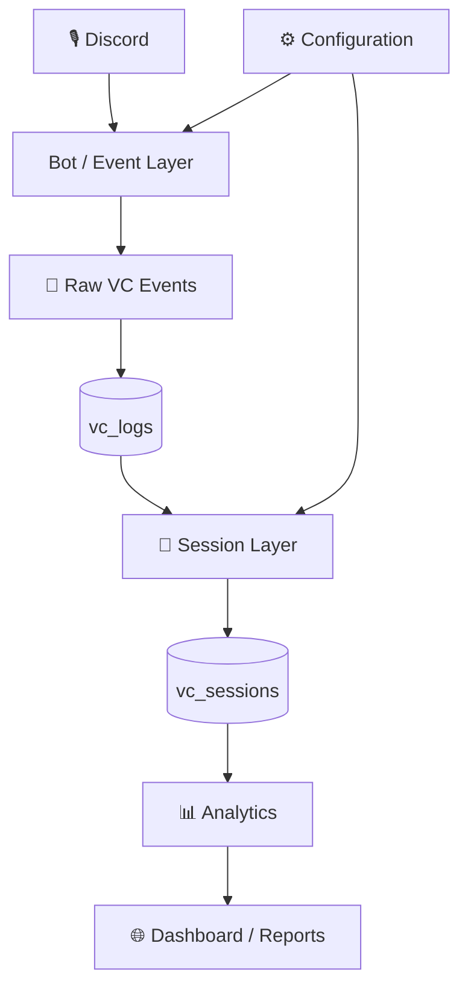
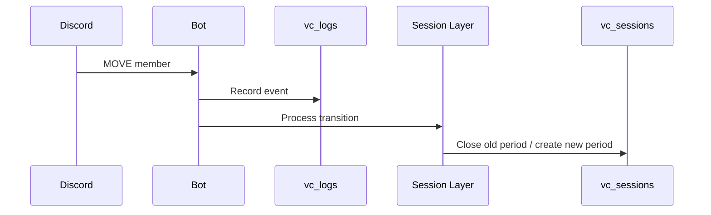
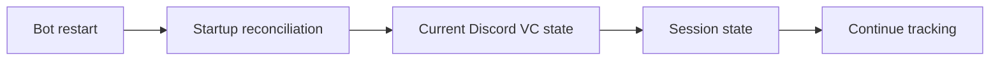

# 🏗️ Architecture

## Overview

Discord VC Controller is organised around a flow from Discord events to stored activity and reporting.



## Components

### 🎙️ Discord event layer

Discord is the source of voice-state transitions such as JOIN, LEAVE, MOVE and disconnect-related changes.

### 📝 Event layer

The application receives those changes and records the relevant voice activity.

### 🗄️ Persistence

The architecture distinguishes raw event history from interpreted sessions.

```text
vc_logs      → event-oriented history
vc_sessions  → session-oriented activity
```

### 🧠 Session layer

The session layer turns transitions into usable periods with start/end boundaries.

### 📊 Analytics

Reports and statistics can operate on the session representation rather than repeatedly rebuilding sessions from raw events.

## 🔄 MOVE flow



## ♻️ Restart flow



## 📅 Reporting flow

```text
Stored sessions
      ↓
Requested period
      ↓
Timezone-aware boundaries
      ↓
Session overlap
      ↓
Duration totals
      ↓
Report
```

## 🧩 Design principle

The main architectural boundary is:

> **Capture events first; interpret them into sessions; calculate statistics from the session model.**

This keeps the raw history useful even when reporting logic changes.

## 🔮 Extensibility

Future features can build on the session layer without changing the fundamental event-capture model.

Examples include:

- VC reservations
- Personal reports
- "Who Was With Me?" based on overlapping sessions
- More advanced server analytics

---

<div align="center">

**🏗️ Events → Sessions → Analytics**

</div>
