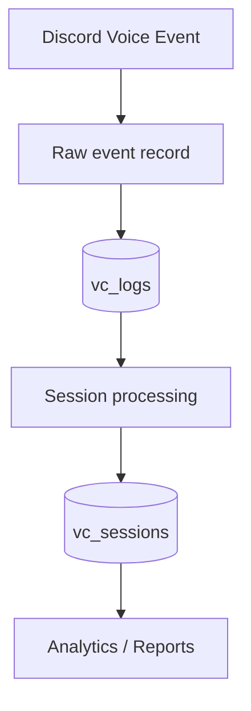

# 🗄️ Database Documentation

## Purpose

This document describes the database side of the VC tracking architecture and how stored voice activity supports reliable reporting.

## Data flow



## 📝 `vc_logs`

`vc_logs` represents the raw event history layer.

It is useful for:

- Auditing what happened
- Debugging tracking problems
- Reconstructing activity
- Investigating unexpected transitions

Think of it as the **event history** rather than the final statistics table.

## 🧠 `vc_sessions`

`vc_sessions` represents interpreted voice sessions.

A session has a meaningful start/end boundary and can therefore be used for duration calculations and reporting.

```text
Raw events
   ↓
Session boundaries
   ↓
Duration
   ↓
Statistics
```

## 🔄 Example

```text
10:00 JOIN  → Lobby
10:20 MOVE  → Gaming
10:50 LEAVE → Gaming
```

The event history describes the transitions, while the session layer can represent the resulting channel periods:

```text
Lobby  10:00 → 10:20
Gaming 10:20 → 10:50
```

## 📊 Why two layers?

| Layer | Main job |
|---|---|
| Raw events | Preserve what happened |
| Sessions | Represent usable activity periods |
| Analytics | Turn sessions into statistics |

Keeping these responsibilities separate makes the system easier to debug and extend.

## ⏱️ Duration calculations

For a closed session:

```text
Duration = end_time - start_time
```

For an open session, reporting can use the current time as the temporary upper boundary.

## 📅 Period queries

A session can overlap a requested period without being completely contained inside it.

```text
Session:          ─────────────────────
Period:                 ───────────────
                         ↑
                     overlap only
```

Reports should therefore calculate the overlap rather than blindly counting the complete session.

## 🌍 Time handling

Database timestamps and reporting boundaries must be interpreted consistently with the application's timezone rules.

Midnight is a particularly important boundary:

```text
Previous day             Today
───────────────|────────────────────
               00:00
```

## 🧪 Database-related testing

Database and session behaviour should be tested around:

- Session creation
- Session closing
- Moves
- Open sessions
- Restart reconciliation
- Date boundaries
- Timezone boundaries

## 🔐 Secrets

Database connection strings and passwords must stay outside source control.

Use environment variables or the project's existing secret/configuration mechanism.

---

<div align="center">

**🗄️ Store the history. Build the sessions. Power the analytics.**

</div>
