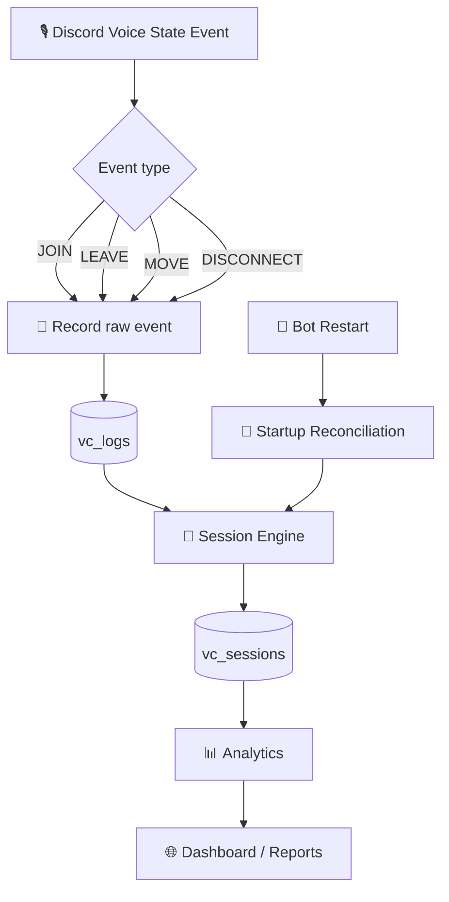
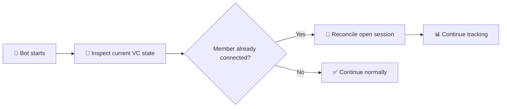
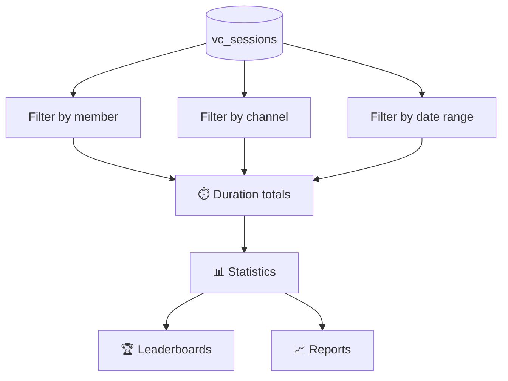

<div align="center">

# 🧠 Hybrid VC Tracking System

### How Discord voice activity becomes reliable statistics


</div>

---

## 🎯 The idea

The VC tracker is built around a **hybrid approach**:

- 📝 **Raw voice events** preserve what Discord reported.
- 🧠 **Sessions** represent the interpreted period a member spent in a voice channel.
- 📊 **Analytics** use the session information to calculate useful statistics.

This means the system does not have to choose between a raw event log and convenient statistics — it keeps both.

---

## 🔥 The complete flow



> **Important:** the diagram describes the architecture represented by the current tracking implementation; exact command/dashboard presentation can evolve independently.

---

# 1. 🎙️ Discord is the source of events

When a member's voice state changes, the bot receives a Discord voice-state event.

Conceptually:

```text
JOIN       → member enters a VC
LEAVE      → member leaves a VC
MOVE       → member changes VC
DISCONNECT → member loses the voice connection
```

The tracker must interpret these transitions rather than treating every event as a complete session.

---

# 2. 📝 Raw events — `vc_logs`

The first layer preserves the event history.

```text
                 Discord
                    │
                    ▼
          ┌──────────────────┐
          │ Voice State Event│
          └────────┬─────────┘
                   │
                   ▼
              ┌─────────┐
              │ vc_logs │
              └─────────┘
                   │
                   ▼
             Raw history
```

### Why keep raw events?

Because a session is an **interpretation** of events. Keeping the underlying events makes the system easier to inspect and troubleshoot.

If something looks wrong in a statistic, you can reason from:

```text
Raw event → interpreted session → statistic
```

instead of storing only the final number.

---

# 3. 🧠 Session reconstruction

A voice session is not necessarily one Discord event.

For example:

```text
10:00  JOIN  → Gaming
10:45  LEAVE → Gaming
```

becomes:

```text
┌─────────────────────────────────────┐
│ VC SESSION                           │
├─────────────────────────────────────┤
│ Member:  User                        │
│ Channel: Gaming                      │
│ Start:   10:00                       │
│ End:     10:45                       │
│ Duration: 45 minutes                 │
└─────────────────────────────────────┘
```

The session layer is therefore the bridge between **Discord events** and **human-readable statistics**.

---

# 4. 🔄 MOVE is special

A move between voice channels should not be treated as a simple leave with no context.

Example:

```text
10:00  JOIN  → Lobby
10:20  MOVE  → Gaming
10:50  LEAVE → Gaming
```

The conceptual session history is:

```text
Lobby  ──────────┐
10:00            │ 20 min
                 ▼
               MOVE
                 │
                 ▼
Gaming ─────────────────────┐
10:20                       │ 30 min
                            ▼
                           LEAVE
```

This allows time to remain associated with the appropriate channel instead of incorrectly merging unrelated VC periods.

---

# 5. ♻️ Restart / reconnect handling

A bot restart should not automatically mean that every currently connected member's session disappears.

The system therefore needs startup reconciliation:



This is one of the reasons a session-oriented architecture is useful for a long-running Discord bot.

---

# 6. ⏱️ Open sessions

A member can still be inside a VC when a statistic is requested.

The system therefore has to distinguish between:

```text
CLOSED SESSION
start ───────── end

OPEN SESSION
start ───────── now
```

For an open session, the current time becomes the temporary calculation boundary until the member actually leaves.

---

# 7. 📅 Period statistics

A session can cross a reporting boundary.

Example:

```text
                 Midnight
                    │
                    ▼
21:00 ───────────── 00:00 ───────────── 02:00
        Day 1              Day 2
```

A **Today** report should count only the part of the session belonging to today.

Conceptually:

```text
session_start = 21:00
session_end   = 02:00

Today contribution = 00:00 → 02:00
```

The same principle applies when producing week/month-style periods.

---

# 8. 🌍 Timezones

Reporting periods depend on the timezone used to interpret dates.

```text
UTC timestamp
     │
     ▼
Timezone conversion
     │
     ▼
Local reporting period
     │
     ▼
Today / Week / Month
```

Keeping timestamp handling consistent is important because a session near midnight can otherwise appear in the wrong reporting period.

---

# 9. 📊 From sessions to statistics

The analytics layer can now work from normalized sessions instead of trying to rebuild everything from scratch every time.



Typical calculations can include:

| Metric | Based on |
|---|---|
| Total VC time | Session durations |
| Daily time | Sessions clipped to the day |
| Weekly time | Sessions clipped to the week |
| Monthly time | Sessions clipped to the month |
| Channel activity | Sessions grouped by channel |
| Member activity | Sessions grouped by member |

---

# 10. 🧪 Why tests matter

Voice tracking has many edge cases that are easy to miss manually.

The project includes tests around important scenarios such as:

```text
✅ JOIN / LEAVE
✅ MOVE
✅ Long sessions
✅ Restart reconciliation
✅ Period boundaries
✅ Timezone behaviour
```

A useful mental model is:

```text
Discord event
      ↓
Expected state transition
      ↓
Session result
      ↓
Statistic
      ↓
Test
```

---

# 11. 💻 Code-reading guide

When modifying the tracker, follow the data through the system rather than changing the final statistic first.

```text
1️⃣ Discord voice event
        ↓
2️⃣ Event recording
        ↓
3️⃣ vc_logs
        ↓
4️⃣ Session reconstruction
        ↓
5️⃣ vc_sessions
        ↓
6️⃣ Analytics / reporting
```

This makes debugging much easier because you can identify whether a problem came from:

- event capture
- event interpretation
- session boundaries
- time calculations
- reporting filters

---

# 12. 🧩 Why call it a hybrid system?

Because it combines two complementary views of the same activity:

<div align="center">

| 📝 Event view | 🧠 Session view |
|:---:|:---:|
| What Discord reported | What the activity means |
| Detailed history | Easy analytics |
| Excellent for debugging | Excellent for reporting |
| Event-oriented | Duration-oriented |

</div>

The result is:

```text
              RAW TRUTH
                  │
              vc_logs
                  │
          ┌───────┴───────┐
          │               │
       Debugging      Processing
                          │
                          ▼
                    vc_sessions
                          │
                          ▼
                     Analytics
```

---

# 🚧 Future extensions

The current architecture gives the project room for features such as:

- 🔊 VC Reservations
- 👥 **Who Was With Me?**
- 📊 Personal VC Reports
- 📈 More detailed server analytics
- 🤖 Additional server workflows

For example, **Who Was With Me?** can be built by comparing overlapping session intervals rather than requiring a completely separate tracking system.

```text
Member A session ─────────────────
Member B session       ────────────
Member C session    ───────────────
                    │
                    ▼
             Shared VC time
                    │
                    ▼
             👥 Who Was With Me?
```

---

# 🏁 Summary

The system can be understood in one line:

```text
🎙️ Discord events
      ↓
📝 Raw event history
      ↓
🧠 Session reconstruction
      ↓
💾 Session data
      ↓
📊 Analytics
      ↓
🌐 Dashboard / reports
```

### The key principle

> **Never throw away the event history just because you want convenient statistics. Keep the raw events, build reliable sessions, and calculate the numbers from those sessions.**

---

<div align="center">

### 🎙️ Discord VC Controller

**Control your VC. Track it reliably. Understand your server.**


</div>
