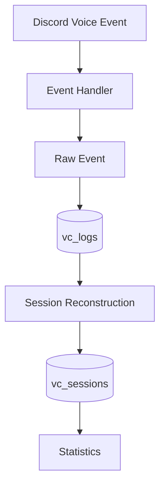
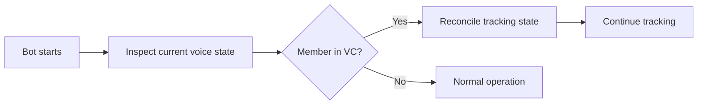

# 🔊 VC Tracking

## Purpose

This document explains the voice-channel tracking model used by **Discord VC Controller**.

## Event → Session → Statistics



### Core principle

The tracker should preserve the original voice activity while also producing a clean session representation for reporting.

```text
Discord event
     ↓
Raw event history
     ↓
Session reconstruction
     ↓
Session duration
     ↓
Statistics
```

## Voice transitions

| Transition | Meaning |
|---|---|
| JOIN | Member enters a voice channel |
| LEAVE | Member leaves a voice channel |
| MOVE | Member changes voice channel |
| DISCONNECT | Voice connection ends unexpectedly |

## 🟢 JOIN

A JOIN starts a voice session for the member and channel.

```text
10:00 JOIN → Gaming
             │
             ▼
      Session is open
```

## 🔴 LEAVE

A LEAVE closes the active session and provides its end boundary.

```text
10:00 JOIN ───────── 10:45 LEAVE
          45 minutes
```

## 🔄 MOVE

A MOVE changes the member's active channel. The previous channel's period must be closed before tracking the new channel.

```text
10:00 JOIN → Lobby
10:20 MOVE → Gaming
10:50 LEAVE

Lobby  : 10:00 → 10:20
Gaming : 10:20 → 10:50
```

This prevents time in different channels from being incorrectly combined.

## ♻️ Restart reconciliation

A bot restart is an important edge case. Members can already be connected when the bot comes back online.



## ⏱️ Open sessions

An active session has no final end timestamp until the member leaves.

```text
CLOSED
start ───────── end

OPEN
start ───────── now
```

When calculating a report while the session is still open, the current time acts as the temporary upper boundary.

## 📅 Reporting periods

A session may cross midnight or another reporting boundary.

```text
21:00 ───────── 00:00 ───────── 02:00
       previous day      today
```

A period report should count only the portion overlapping the requested period.

Conceptually:

```text
overlap = session ∩ reporting_period
```

This prevents a long session from being counted entirely inside the wrong day, week, or month.

## 🌍 Timezones

Reporting dates depend on the timezone used by the application.

```text
Stored timestamp
      ↓
Timezone interpretation
      ↓
Local reporting boundary
      ↓
Today / Week / Month
```

Timezone handling is especially important around midnight.

## 📊 Statistics

Statistics should be derived from normalized session durations.

| Statistic | Source |
|---|---|
| Total VC time | Session duration |
| Daily time | Period-clipped sessions |
| Weekly time | Period-clipped sessions |
| Monthly time | Period-clipped sessions |
| Channel activity | Sessions grouped by channel |
| Member activity | Sessions grouped by member |

## 🧪 Edge cases

The tracker needs to account for:

- JOIN followed by LEAVE
- JOIN followed by MOVE
- Multiple channel changes
- Unexpected disconnects
- Long-running sessions
- Bot restart/reconnect
- Members already in VC at startup
- Sessions crossing reporting boundaries
- Timezone boundaries

## 🛠️ Debugging approach

When a statistic looks wrong, trace it backwards:

```text
Wrong statistic
      ↑
Session duration
      ↑
Session boundaries
      ↑
Raw events
      ↑
Discord voice state
```

This makes it easier to determine whether the problem is in event capture, session reconstruction, duration calculation, or reporting.

## 🔐 Data safety

Never commit Discord bot tokens, database passwords, or other secrets into the repository. Use environment/configuration values instead.

---

<div align="center">

**🔊 Track the event. Reconstruct the session. Calculate the truth.**

</div>
